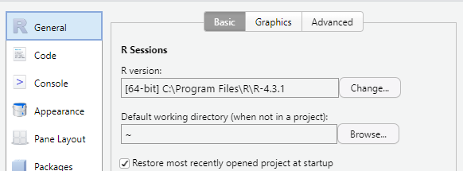
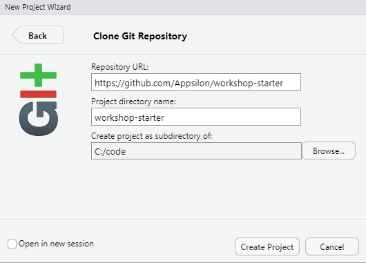
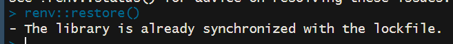
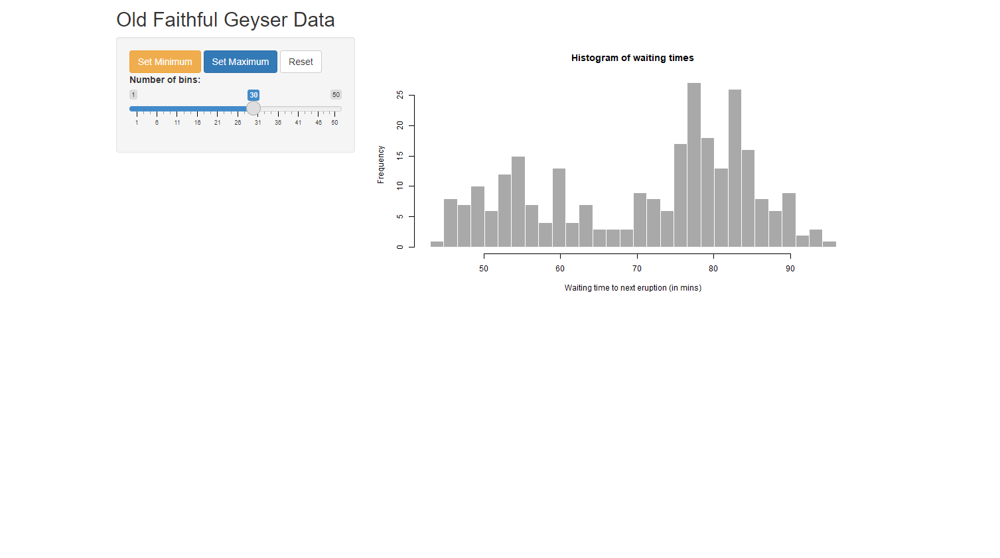

# workshop-starter

Welcome to the workshop repository! Here you'll find the code which we will use during the hands-on sessions.

Please complete the following steps before the workshop to ensure you are ready to work on the assignments:

## Getting started

1. Make sure you are running R version 4.3.1 or higher (In RStudio choose Tools, Global Settings)
   

2. Download the current repo to get started. You can use your favorite git management tool, or if using RStudio choose File, New Project, Version Control, from Git.

   

3. Install all required packages. This repository is using `renv` so it should be as simple as running `renv::restore()` from your console

   

4. After restoring you should be able to run the existing `app.R` application.

   

5. Youre good to go! We will be adding more to this repository during the workshop, see you soon!
