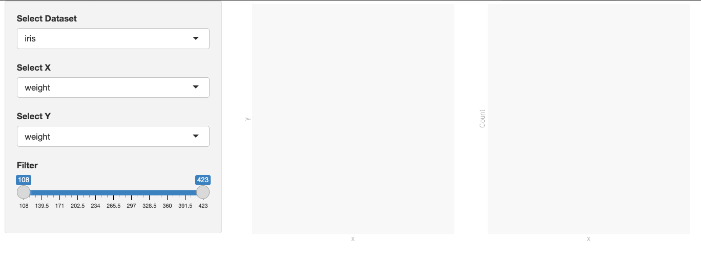

The issue was caused by the app trying to use the updated dataset, before dropdowns were updated with new choices.

The variables from previous dataset are not present in the new one.

This could be more easy to observe with network throttling, when time between update of dataset, variables and plots is longer.
